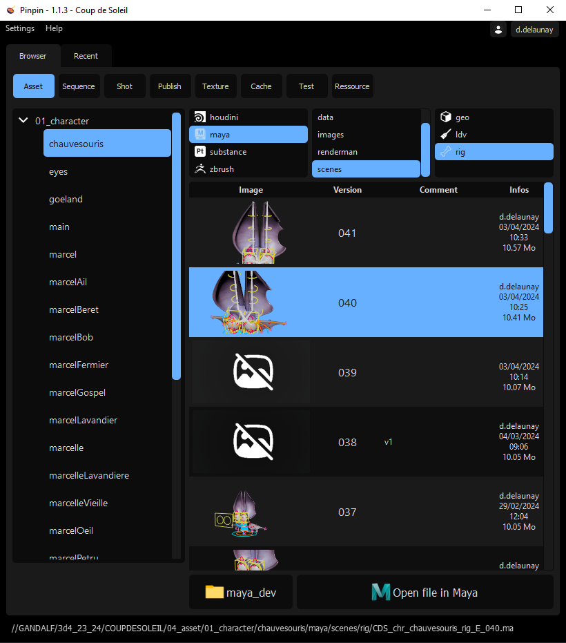
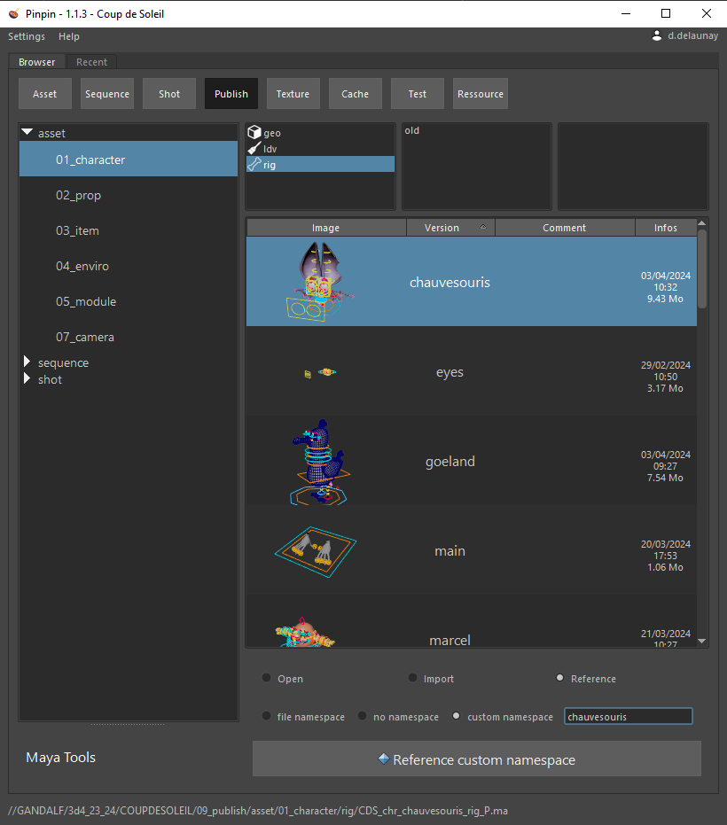
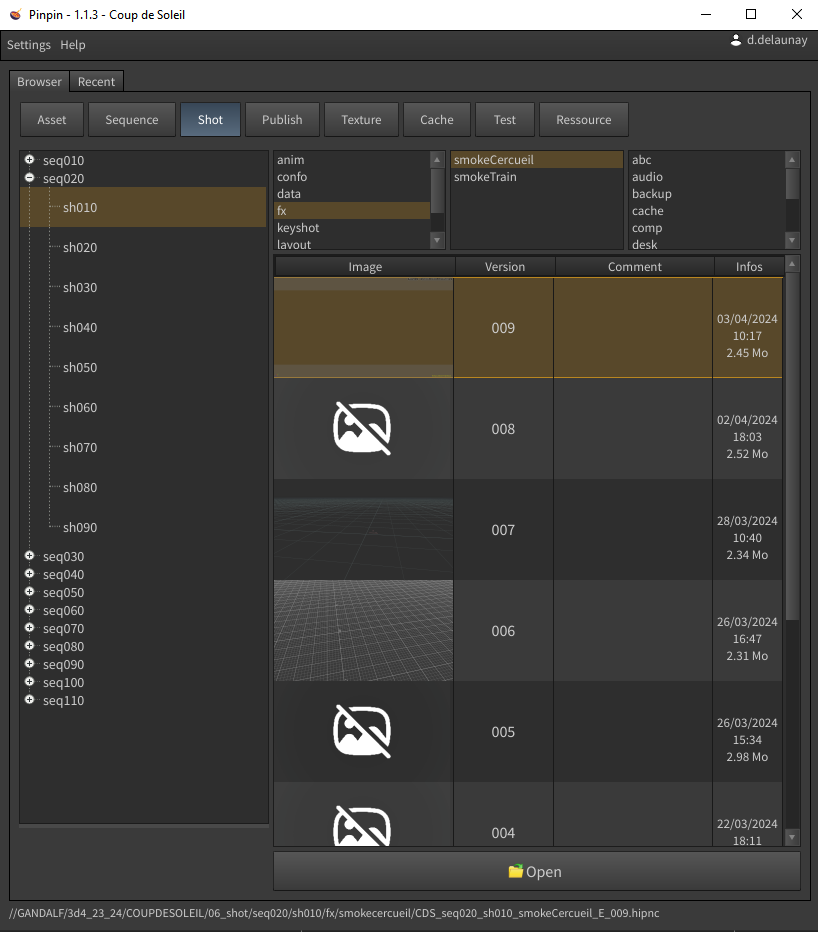

=============================================
Pinpin 1.1.4 Documentation (work in progress)
=============================================

Pinpin is a pipeline manager created for ESMA Montpellier 2023-2024 films.
| You can find the documentation on `pinpin.readthedocs.io <https://pinpin.readthedocs.io/>`_
| Video demo : `pinpin_demo <https://drive.google.com/file/d/10YehbPR1uPyZ06t0iNpxC801drbTmxbr/view?usp=sharing>`_
| Python 3.9.7 - PySide2 5.15.2
| Works with Windows 10, Maya 2023.3 and higher, Houdini 19.5 and higher

Authors:
| Backend: `David Delaunay <https://www.linkedin.com/in/david-delaunay-472591208/>`_
| Frontend: `Louis Bonnaud <https://www.linkedin.com/in/louis-bonnaud-306326269/>`_

.. image::
   documentation/images/pinpin_image.png

Standalone browser
==================

Maya browser
============

Houdini browser
===============

| Our main inspirations:
| Prism: `GitHub repository <https://github.com/PrismPipeline/Prism>`_
| Pipou: `Demo video <https://vimeo.com/329157278>`_ 
| Piper: `Demo video <https://www.youtube.com/watch?v=9YwH1fDXUB4>`_