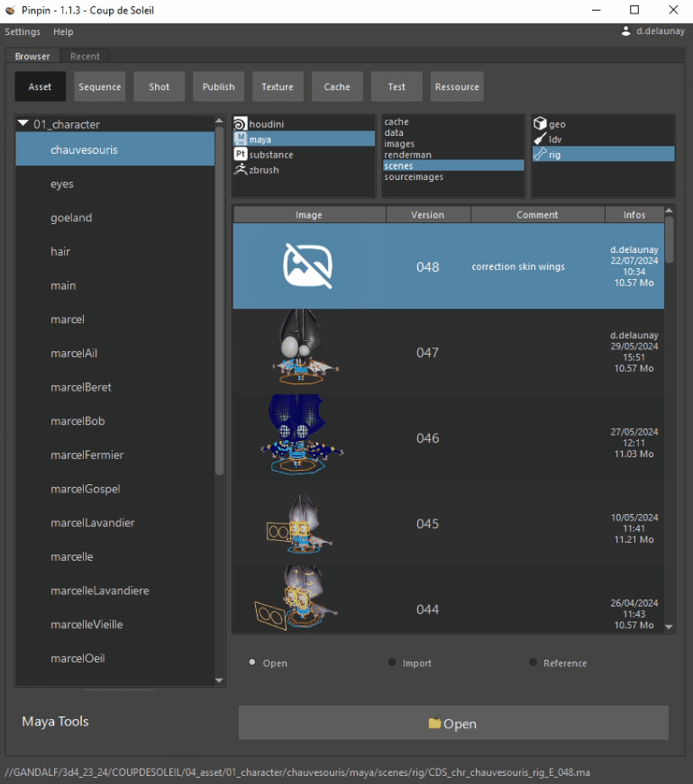
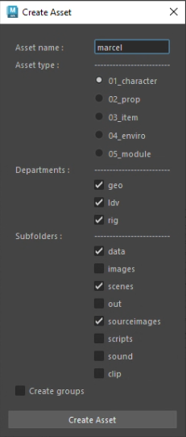

.. _maya:

Maya
====

Browser
-------

| In maya, we find the same file browser, we can : 
| - Open the file in the maya session
| - Import with default namespace, custom namespace or without namespace
| - Create a reference with default namespace, custom namespace or without namespace

Utils
-----

Create asset
------------

Edit & Publish
--------------

Alembic workflow
----------------