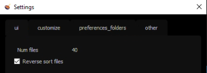

.. _standalone:

Standalone
==========

Browser
-------

You can browse the project assets:

.. image::
    ../../images/standalone_browser_features.gif

| By right-clicking on a file, you can:
| - Reveal the location of the file in File Explorer
| - Increment the file
| - Write a comment

Under the file section, you have buttons to open the file in maya and another to change preferences directory (useful for development).

.. tip::
    You can also open a file by double-clicking on its line in the file section, which is much faster.

.. caution::
    If a file has not been opened for a long time, it is preferable to increment it from the standalone application rather than opening the latest version.

Settings
--------

In the settings dialog, you can choose the number of files displayed in the file section and the display order (reverse by default to access the latest versions).
