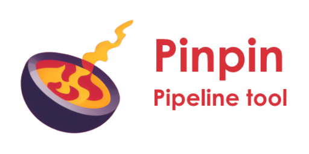

.. Pinpin documentation master file, created by
   sphinx-quickstart on Fri Jun 21 13:15:56 2024.
   You can adapt this file completely to your liking, but it should at least
   contain the root `toctree` directive.

=============================================
Pinpin 1.1.4 Documentation (en cours)
=============================================

Pinpin est un gestionnaire de pipeline créé à l'origine pour les films de l'ESMA Montpellier 2023-2024.

| Auteurs:
| Backend: David Delaunay
| Frontend: Louis Bonnaud

Liens : `Dépôt GitHub <https://github.com/DavidDelaunay43/Pinpin>`_ /
`Vidéo démo <https://drive.google.com/file/d/10YehbPR1uPyZ06t0iNpxC801drbTmxbr/view?usp=sharing>`_

------------

.. toctree::
   :maxdepth: 10

   installation
   pipeline
   standalone
   maya
   houdini