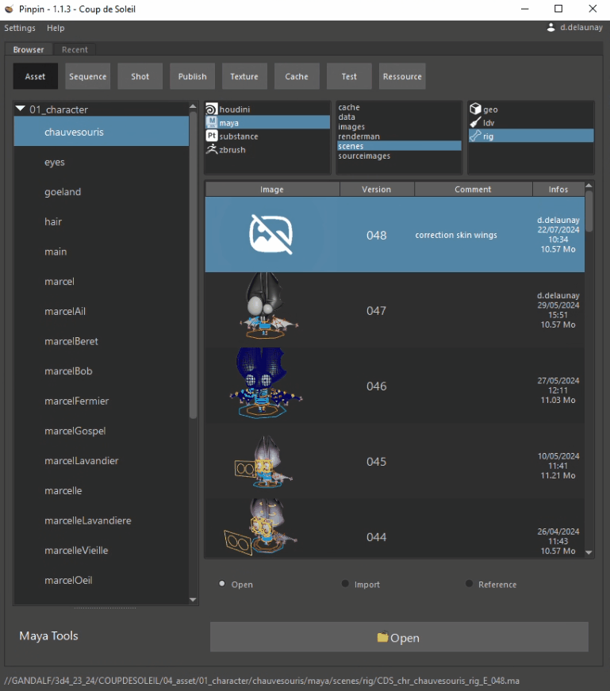
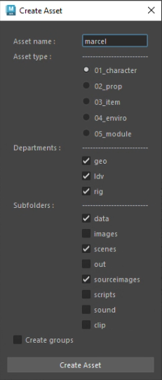

.. _maya:

Maya
====

Browser
-------

| Dans Maya, on retrouve le même explorateur de fichiers, on peut : 
| - Ouvrir un fichier dans la session Maya
| - Importer avec namespace par défaut, namespace personnalisé ou sans namespace
| - Créer une référence avec namespace par défaut, namespace personnalisé ou sans namespace

Utils
-----

Create asset
------------

Edit & Publish
--------------

Alembic workflow
----------------