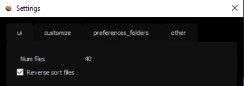

.. _standalone:

Standalone
==========

Browser
-------

Vous pouvez parcourir les ressources du projet :

.. image::
    ../../images/standalone_browser_features.gif

| En cliquant avec le bouton droit de la souris sur un fichier, vous pouvez :
| - Révéler l'emplacement du fichier dans l'explorateur de fichiers
| - Incrémenter le fichier
| - Ecrire un commentaire

Sous la section fichier, vous avez des boutons pour ouvrir le fichier dans Maya et un autre pour changer le répertoire des préférences (utile pour le développement).

.. tip::
    Vous pouvez également ouvrir un fichier en double-cliquant sur sa ligne dans la section des fichiers, ce qui est beaucoup plus rapide.

.. caution::
    Si un fichier n'a pas été ouvert depuis longtemps, il est préférable de l'incrémenter à partir de l'application standalone plutôt que d'ouvrir la dernière version.

Settings
--------

Dans la boîte de dialogue des paramètres, vous pouvez choisir le nombre de fichiers affichés dans la section des fichiers et l'ordre d'affichage (inversé par défaut pour accéder aux dernières versions).
